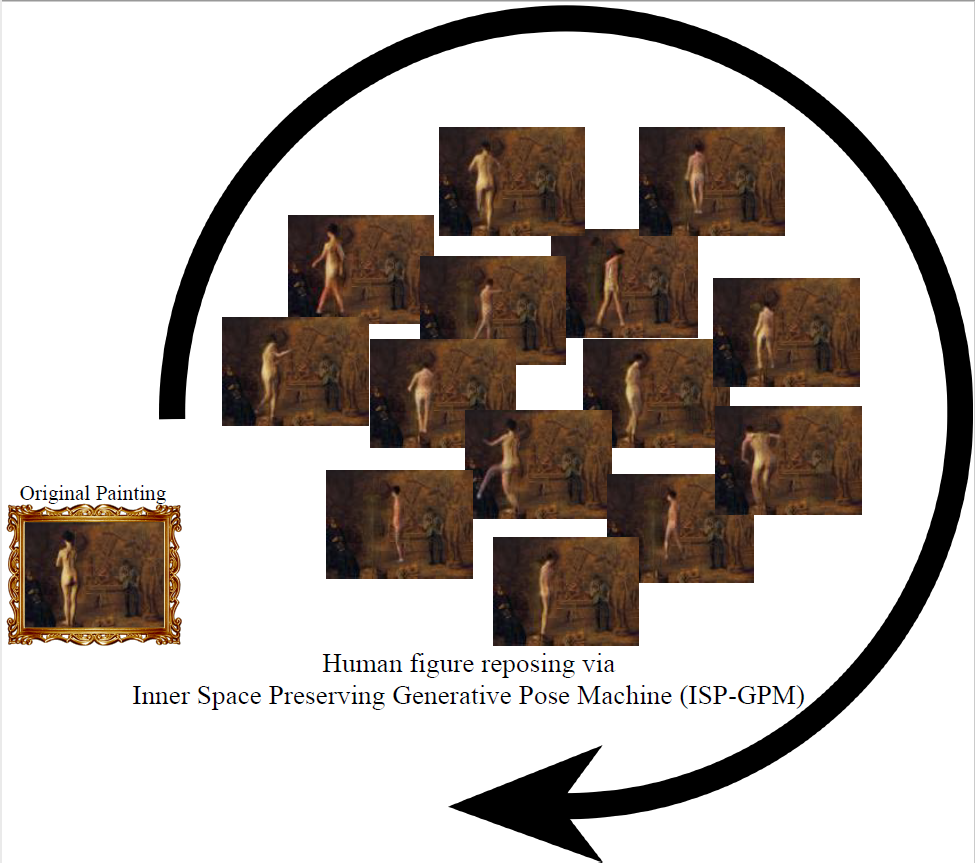

# Inner Space Preserving - Generative Pose Machine (ISP-GPM)

This is the code for the following paper:

Shangjun Liu, Sarah Ostadabbas  [Inner Space Preserving - Generative Pose Machine](https://arxiv.org/abs/1701.01370), ECCV 2018.  !!!! change link! !!! 

Check the [project page](http://www.di.ens.fr/willow/research/surreal/) for more materials.  !!! link!!! 





Contact: 
[Shuangjun Liu](liu.shu@husk.neu.edu),

[Sarah Ostadabbas](ostadabbas@gmail.com)
## Contents  !!! work on later according to the content we have 
* [1. Requirement](#1-requirement)
* [2. Download SURREAL dataset and Index files](#2-wownload-surreal-dataset-and-index-files)
* [3. Path settings](#3-path-settings)
* [4. Training](#4-training)
* [5. Testing](#5-testing)
* [6. Evaluation](#-evaluation)
* [Citation](#citation)
* [License](#license)
* [Acknowledgements](#acknowledgements)


## 1. Requirement 
* Install [Torch](https://github.com/torch/distro) with [cuDNN](https://developer.nvidia.com/cudnn) support.
* Install [matio](https://github.com/soumith/matio-ffi.torch) by `luarocks install matio`
* Install [OpenCV-Torch](https://github.com/VisionLabs/torch-opencv) by `luarocks install cv`
* Install [display server](https://github.com/szym/display) by `luarocks install https://raw.githubusercontent.com/szym/display/master/display-scm-0.rockspec`
* Download [SURREAL](https://github.com/gulvarol/surreal#1-download-surreal-dataset)
* Download [valid Index](http://www.coe.neu.edu/Research/AClab/GPM/cmu.zip)

*Tested on Unbuntu 16.04  with cuda v8 and cudNN v5.1. .*

## 2. Download SURREAL dataset and Index files 
There are 4 major data files in each sequence in SURREAL
```
<sequenceName>_c%04d.mp4 
<sequenceName>_c%04d_depth.mat
<sequenceName>_c%04d_segm.mat
<sequenceName>_c%04d_info.mat 
```

For our training purpose, you only need to download the `<sequenceName>_c%04d.mp4 ` mp4 files and 
`<sequenceName>_c%04d_info.mat ` files

We notice that some sequences only partially contain the human body or even not at all in original surreal which is not sutiable for our reposing purpose. 
Our logic is simple, if we don't even observe the human body, we can by no means repose it. So our strategy is direct, only keep the frame number with fully observed human. 
Please download [valid frame index](http://www.coe.neu.edu/Research/AClab/GPM/cmu.zip) generated by us and copy them (test, train, val volder) directly to the original surreal folder structure under 
*cmu/..*

## 3. Path settings
### Dataset path
Set the dataset root. 

Set the datasetname. 

In our case, <dataseRoot>/cmu 

### Experiment path 
Set your experiment root by -logRoot

Set your experiment name by -dirName 

All models and generated results will be saved here 

### Sample path 
We provide a few samples from different domains including real human, paitings and sculptures located in folder samples. 
You can provide your own source location by setting '-genFd' option 

## 4. Training  
We provide an example of training a model with cGAN configuration by 

'th main.lua -dirName <your_experiment_id> -cGAN'

For customized settings, please set opts.lua accordingly or pass in by command lines. 

## 5. Testing 
You can repose the provided samples by 

'th main.lua -epochNumber <yourEpochNum + 1> -flgGenFd -dirName <your_model_nm>'

You can download our pretrained model with 2 layer discriminator [GPM_MP_D2](http://www.coe.neu.edu/Research/AClab/GPM/GPM_MP_D2.zip) with 50 epoches 
In this case: 
'th main.lua -epochNumber 51 -flgGenFd -dirName GPM_MP_D2'

## 6. Evaluation 
We provide the inner space preserving evaluation of first 100 images of SURREAL in validation set: 
'th main.lua -dirName GPM7 -epochNumber 51 -ifTsRMS'

For human pose estimation, please download the [stacked-hour-glass](https://github.com/umich-vl/pose-hg-train). Then evaluate the pose estimation result on reposed humans against the ground truth that employed during reposing. 

## Citation 
If you use this code, please cite the following:
```
@INPROCEEDINGS{shuangjun_surreal,  
  title     = {Inner Space Preserving Generative Pose Machine},  
  author    = {Shuangjun Liu, Sarah},  
  booktitle = {ECCV},  
  year      = {2018}  
}
```


## License 
* This code is for non-commertial purpose only. For other uses please contact ACLab of NEU. 
* No maintainence survice 

## Acknowledgements
The training sesssion depends on [SURREAL](https://github.com/gulvarol/surreal) dataset written by [Gul Varol](https://github.com/gulvarol)
The Conditional GAN descriminator comes from original work of [image-to-image translation with conditional adversarial nets](https://phillipi.github.io/pix2pix/) by [Phillip Isola](https://github.com/phillipi)


